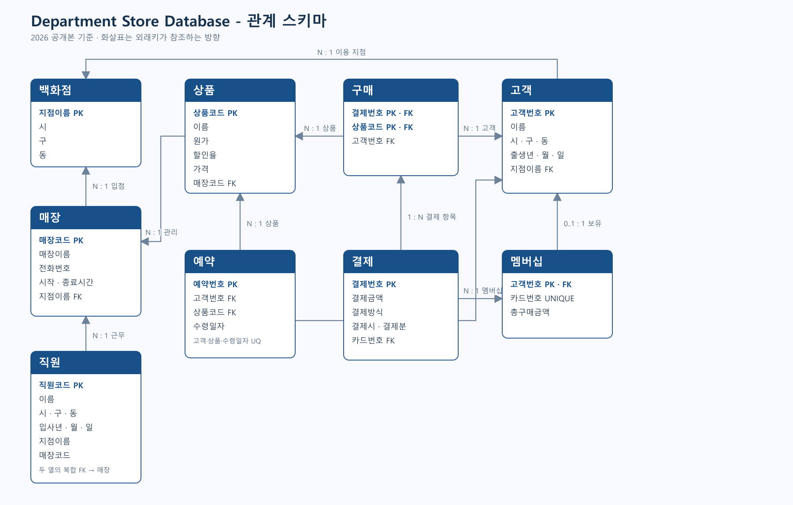

# Department Store Database

백화점 운영 데이터를 대상으로 요구사항 분석, ER 모델링, 관계 스키마 변환,
Oracle SQL 구현까지 수행한 2022년 데이터베이스 과목 2인 팀 프로젝트입니다.

- 기간: 2022년
- 유형: 데이터베이스 과목 2인 팀 프로젝트
- DBMS: Oracle Database
- 범위: 백화점·매장·직원·고객·멤버십·결제·상품·구매·예약



## 나의 기여

요구사항 분석, ERD 설계, 관계 스키마 변환과 SQL 구현을 팀원과 공동 수행했습니다.

개인별 세부 구현을 구분할 기록이 남아 있지 않아 특정 테이블이나 SQL을
단독 구현한 것으로 표기하지 않습니다.

## 저장소 구성

```text
.
├── README.md
├── docs/
│   └── erd.png
└── sql/
    ├── schema.sql
    ├── sample_data.sql
    ├── queries.sql
    └── verify.sql
```

- `schema.sql`: 테이블과 PK·FK·UNIQUE·CHECK 제약조건
- `sample_data.sql`: 공개용으로 새로 작성한 소규모 익명 예제 데이터
- `queries.sql`: 원 발표에서 다룬 조회 시나리오 6개
- `verify.sql`: 예제 데이터의 참조·금액 정합성과 반복 구매 표현을 확인하는 간단한 검증
- `erd.png`: 공개용 관계 스키마를 기준으로 다시 작성한 ERD

## 실행

Oracle SQL Developer 또는 SQL*Plus에서 다음 순서로 실행합니다.

```sql
@sql/schema.sql
@sql/sample_data.sql
@sql/queries.sql
@sql/verify.sql
```

## 원본과 공개본

2022년 수업 당시 요구사항 분석, 설계와 SQL 작성에는 생성형 AI를 사용하지
않았습니다. 이 저장소는 2026년 포트폴리오 공개를 위해 SQL 서식과 파일 구조를
정리하고, 개인정보가 포함될 수 있는 원본 데이터 대신 익명 예제 데이터를
작성했으며 ERD를 다시 그린 버전입니다. 원본 PPT/PDF는 공개하지 않습니다.

공개본에서는 프로젝트 범위를 유지하면서 다음 오류와 제약만 소폭 개선했습니다.

- 예약번호를 예약의 기본키로 사용
- 구매 기본키를 `(결제번호, 상품코드)`로 변경해 같은 고객의 반복 구매 허용
- 고객당 하나의 멤버십만 허용하고 카드번호의 고유성 유지
- 직원의 지점과 매장이 서로 일치하도록 복합 외래키 적용
- 서울 지점 고객 집계 조건과 다중 행을 반환할 수 있던 서브쿼리 수정

## 한계

수업 당시 범위를 따르므로 재고 수량, 구매 수량, 결제 일자는 모델링하지 않았습니다.
운영 시스템이 아니라 관계형 모델링과 SQL 학습 결과를 정리한 저장소입니다.
